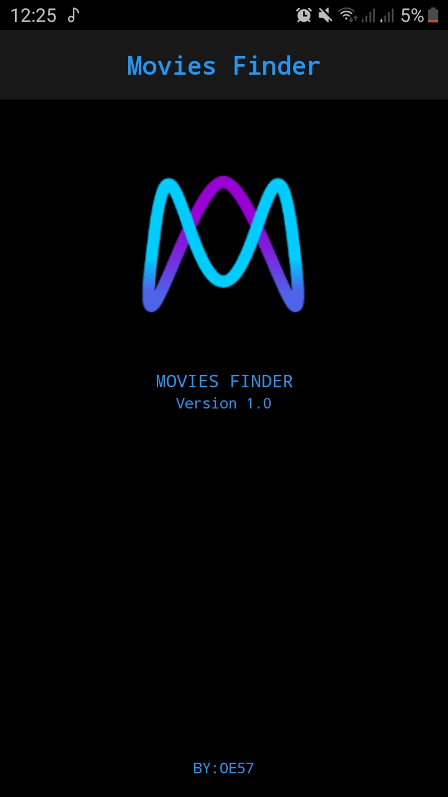
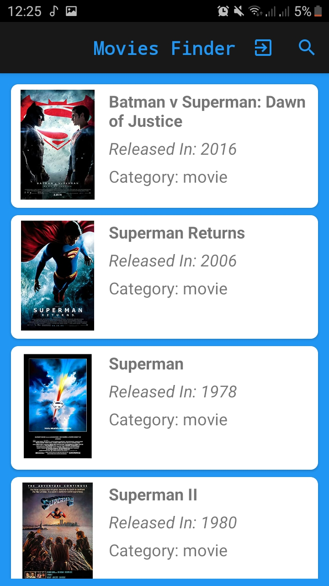
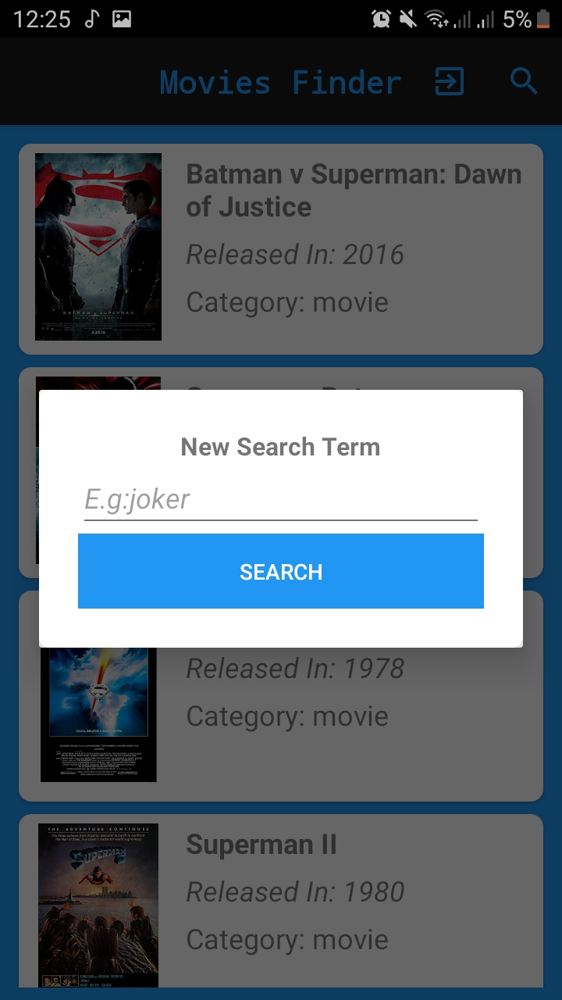
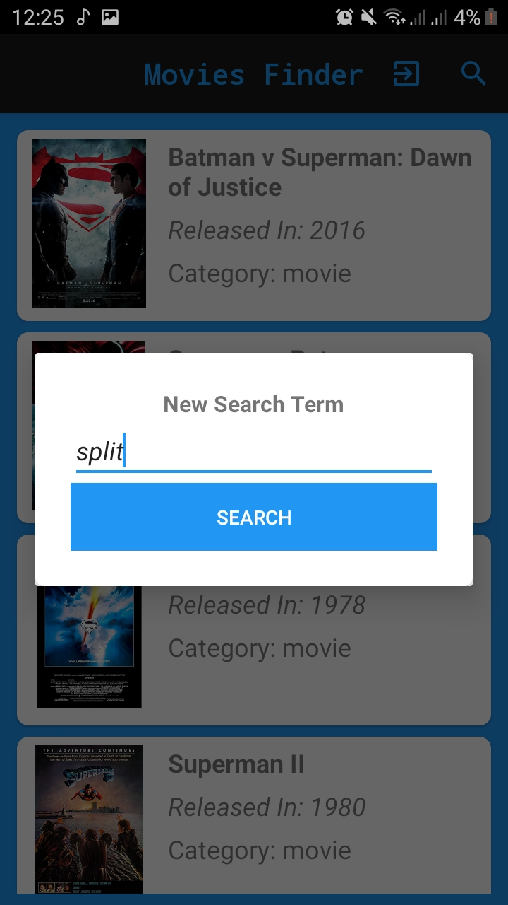
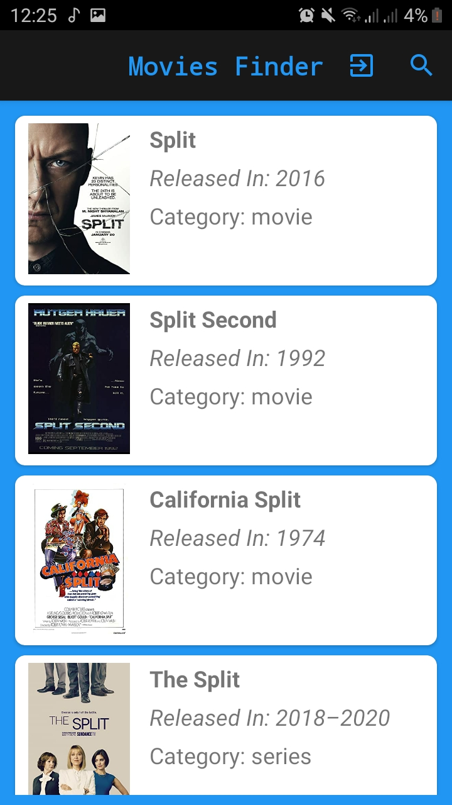
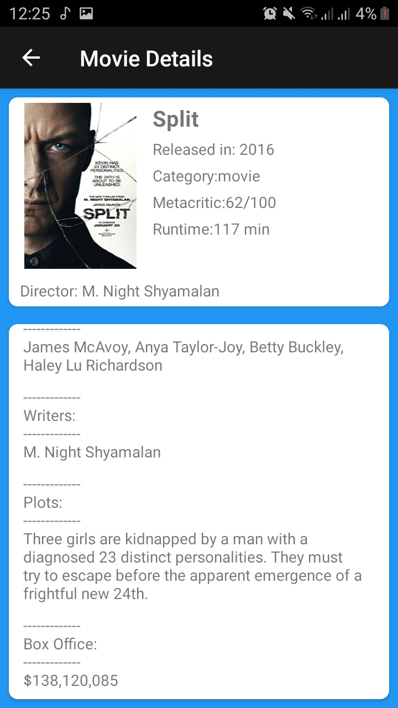
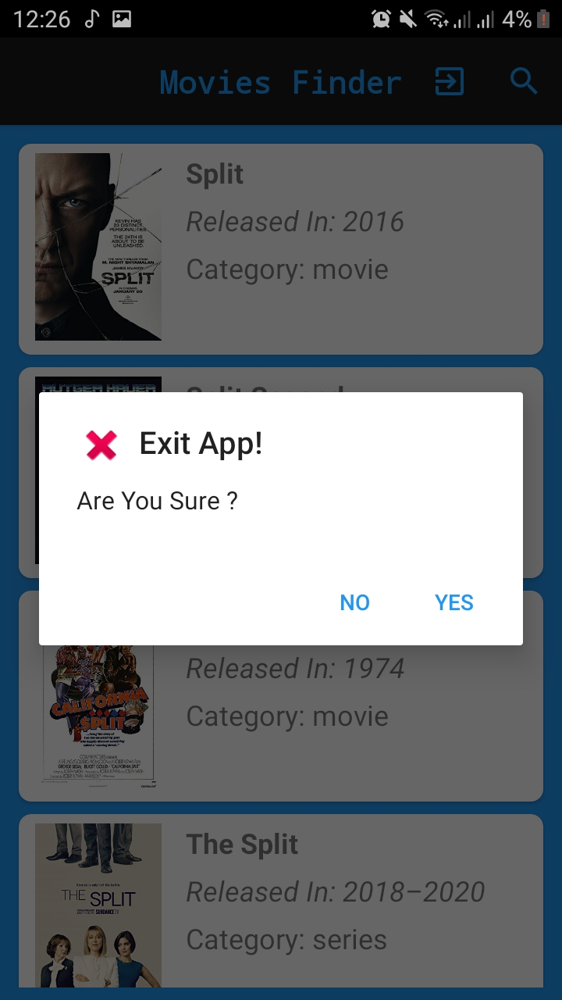

# Images 
,
,
,
,
,
,

# Description
movies directory app depend on OMDb API that presents all details of the movies your search on it , you can search any movies and get all details about it , when you close the app and rut it agin it show the last movie that your are searched. 

# API
http://www.omdbapi.com/

# volley library
https://developer.android.com/training/volley
# Picaso Library
https://github.com/square/picasso

